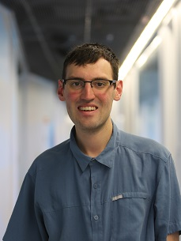

---
# Feel free to add content and custom Front Matter to this file.
# To modify the layout, see https://jekyllrb.com/docs/themes/#overriding-theme-defaults

layout: default
---

  

    
  

  

    <canvas width="500px" height="275px" id="c"></canvas>
    
    <i>
    <!-- Whitespace hack cause I'm lazy -->
    &nbsp;&nbsp;&nbsp;&nbsp;&nbsp;&nbsp;&nbsp;&nbsp;&nbsp;&nbsp;&nbsp;&nbsp;&nbsp;
    Phong lighting model built in <a href="https://github.com/cucapra/linguine">Gator</a>
    </i>
  

# About
---
I’m Dietrich Geisler, a 5th year PhD student in Computer Science at Cornell University.
I work with the [Capra research group](https://capra.cs.cornell.edu/) led by [Adrian Sampson](https://www.cs.cornell.edu/~asampson/research.html).

My research goals are focused on the development of [Domain Specific Languages](https://en.wikipedia.org/wiki/Domain-specific_language), with an emphasis on helping the programmer more easily write readable and correct programs.

My current research is on exploring bindings (which are mechanisms to transfer data between two devices) and the language design around improving heterogeneous (multi-device) binding analysis.  In particular, I'm working with Oliver Daids (a first-year PhD) on developing a declarative language semantics for heterogeneous bindings and an optimizing compiler.  I'm also working with [Zhijing Li](https://tissue3.github.io/) on developing an optimizing heterogeneous IR for representing optimizations "across the device boundary".  Finally, I'm working with [Tess](https://tess-factor.com/) and [David Siher](https://www.linkedin.com/in/david-siher-372398205) on the [Slang graphics language](http://graphics.cs.cmu.edu/projects/slang/).

My previous research is on developing the [Gator](https://github.com/cucapra/gator) language for geometric programming.  Our OOPSLA 2020 paper preprint on Gator can be found [here](oopsla2020.pdf).
Gator is designed to help Graphics programmers reason about the geometry of the program through annotations and compiler typechecking.
The primary contribution of Gator is the introduction of a type structure around *Reference Frames*, an idea rooted in [geometry](https://en.wikipedia.org/wiki/Frame_of_reference).

[CV](cv.pdf)
